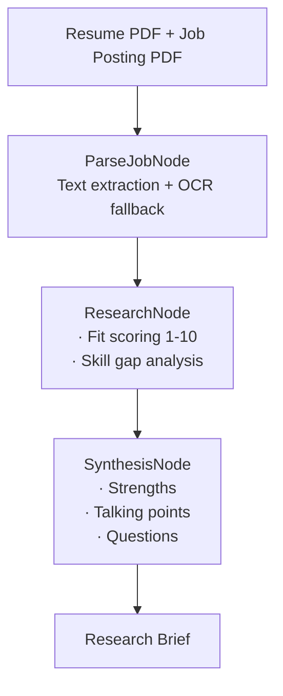

# Job Research Agent

A multi-agent job research tool that reads your resume and a job posting, scores your fit 1–10, identifies skill gaps, and generates a structured interview prep brief — powered by PocketFlow and Gemini 2.0 Flash.


## Architecture:

Shared store passes context between nodes.

## Why PocketFlow?
Minimal 100-line frame work - no abstraction overhead, full visibility into agent execution flow.

## Interfaces
- **CLI**: `python app.py <resume.pdf> <job_posting.pdf|job_posting.txt>`
- **API**: FastAPI app with `POST /job-research` (multipart upload)

## OCR behavior (scanned PDFs)
This project first attempts to extract text from PDFs using `pypdf`. If **no extractable text** is found (common with scanned/image-only PDFs), it falls back to **OCR**:

- **Decision**: prefer a robust OCR approach by using **OCRmyPDF** to generate a temporary *searchable PDF*, then re-extract text from that output.
- **Where**: `job-research-agent/utils/pdf_utils.py` (called from `job-research-agent/nodes.py` for both job postings and resumes).
- **Notes**:
  - OCR can be slow on multi-page/high-DPI PDFs.
  - OCR requires **system dependencies** (below). Installing `ocrmypdf` via Poetry does not install these OS-level tools.

## Speed optimizations (and tradeoffs)

End-to-end latency is dominated by **OCR on scanned PDFs** and **three sequential Gemini calls** (parse job → research → synthesis). The following knobs reduce wall-clock time; each trades accuracy, completeness, or quality for speed.

### LLM (`job-research-agent/utils/call_llm.py`)

| Optimization | What it does | Tradeoff |
|--------------|----------------|----------|
| **`gemini-2.0-flash`** | Uses a faster Flash model than e.g. `gemini-2.5-flash`. | May be slightly worse at nuanced reasoning, long-context fidelity, or structured JSON on messy inputs. Tune by switching `model=` if quality drops. |
| **`thinking_config` with `thinking_budget=0`** | Disables extended “thinking” on models that support it (`ThinkingConfig`). | Faster responses; less internal deliberation on models where thinking would otherwise run. If you use a model without thinking, this is effectively a no-op. |

JSON output mode (`response_mime_type="application/json"`) is kept for reliable parsing; it is not primarily a speed lever.

### PDF / OCR (`job-research-agent/utils/pdf_utils.py`)

| Env var | Default | What it does | Tradeoff |
|---------|---------|--------------|----------|
| `JOB_RESEARCH_MAX_PAGES` | `3` | Only reads (and OCRs) the first *N* pages for both PDFs. | Faster OCR and smaller prompts. Anything important on page 4+ is ignored. Set `0` to disable the cap (slowest, most complete). |
| `JOB_RESEARCH_OCR_JOBS` | `min(4, cpu_count)` | Parallelism for OCRmyPDF page workers. | Too high can oversubscribe CPU and *slow* runs on small machines; the default caps at 4. |

OCRmyPDF is also called with speed-oriented flags: `skip_text=True` (skip pages that already have a text layer), `optimize=0` (skip file-size optimization pass), `output_type="pdf"` (skip PDF/A generation). **Tradeoff:** slightly larger temporary PDFs and less aggressive normalization; usually negligible for this use case.

### API (`app.py`)

The PocketFlow + LLM work runs in a **thread pool** (`run_in_threadpool`) so the event loop stays responsive. That does not shorten a single request’s compute time; it avoids blocking other requests.

## Dependencies
### Python dependencies (installed via Poetry)
```bash
poetry install
```

### System dependencies (required for OCR)
OCR is optional at runtime, but **required** for scanned/image-only PDFs.

- **Tesseract OCR** (required): `tesseract.exe` must be installed and available on PATH
- **Ghostscript** (usually required by OCRmyPDF): `gswin64c.exe` (64-bit) must be installed and available on PATH


PowerShell checks:
```powershell
where.exe tesseract
tesseract --version

where.exe gswin64c
gswin64c --version
```

For mac:
```
brew install tesseract ghostscript
```

## How to run
### CLI
```bash
poetry install
poetry run python app.py path/to/resume.pdf path/to/job_posting.pdf
```

### FastAPI
```bash
poetry run uvicorn app:app --reload
```

`POST /job-research` (multipart form):
```bash
curl -X POST "http://127.0.0.1:8080/job-research" `
  -F "resume_file=@path/to/resume.pdf;type=application/pdf" `
  -F "job_posting=@path/to/job_posting.pdf;type=application/pdf"
```

### Troubleshooting
- **`tesseract not found on PATH`**: install Tesseract and reopen your terminal (PATH updates require a new shell).
- **Ghostscript warnings**: OCRmyPDF may warn about certain Ghostscript versions; upgrading Ghostscript can help.